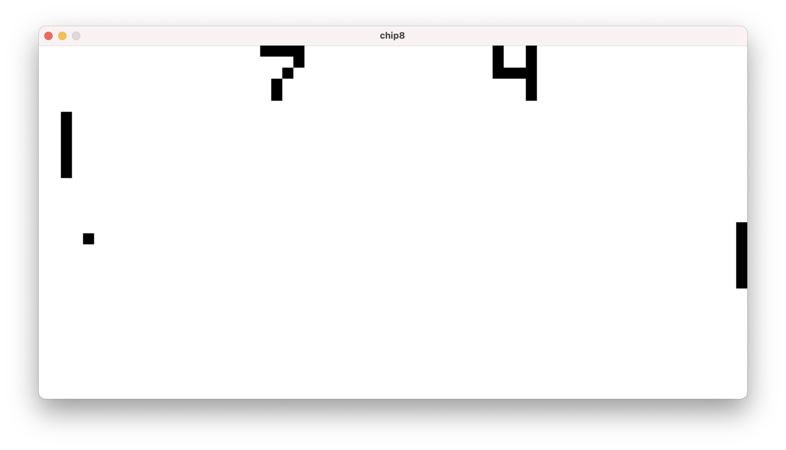

# Chip-8

A [Chip-8](https://en.wikipedia.org/wiki/CHIP-8) [bytecode interpreter](https://en.wikipedia.org/wiki/Interpreter_(computing)#Bytecode_interpreters) written in the [ruby](https://www.ruby-lang.org/) programming language.



## Installation

> :warning: Heads up! This has only been tested on OSX.

- Install [SDL](https://en.wikipedia.org/wiki/Simple_DirectMedia_Layer) by executing `brew install sdl`. It is used for handling keyboard events and drawing onto the screen.
- Clone the repository with the `git clone` command
- Navigate into the cloned folder
- Execute `bundle` to install required gems

## Usage

```
$ bin/chip8
Usage: chip8 [rom]

Options:
  --debug          Prints every instruction before executing
  --dump-memory    Loads the rom and dumps the memory content
```

## Testing

[Minitest](https://github.com/seattlerb/minitest) is used fot testing. Tests can be run by executing `bundle exec rake`.

## References
- [Cowgod's Chip-8 Technical Reference](http://devernay.free.fr/hacks/chip8/C8TECH10.HTM)
